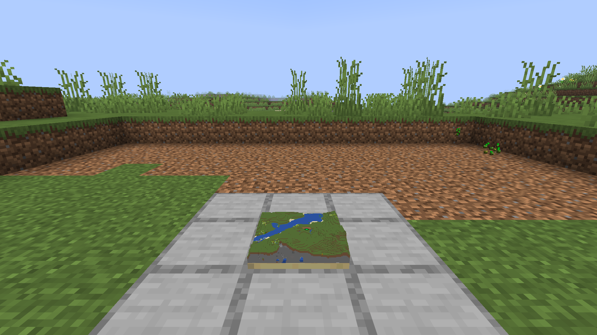

# Map++

A Minecraft Fabric mod. Maps and compasses get slots of their own, and an equipped map becomes a minimap you can actually read.

## Screenshots

## What This Mod Does

A map is a thing you hold, which means it is a thing you are not holding a sword with. Carrying one costs a hotbar slot and every glance at it costs the use of your hand, so in practice nobody navigates by map: they make one, look at it once, and put it in a chest.

Here a map and a compass each get **a slot of their own** on the inventory screen, and a map sitting in that slot draws itself in the corner of your screen, live, while your hands stay free.

## The Slots

Two extra squares on the vanilla inventory screen: one that takes a map, one that takes a compass — regular, lodestone, or recovery. Any map with something drawn on it goes in the map slot, the explorer maps included; a blank map does not, since there is nothing on it to show. They persist across sessions and across deaths, and they are ordinary inventory as far as everything else is concerned.

## The Minimap

A map in the slot is drawn in a screen corner, updating as you move.

**Your own marker is vanilla's.** The same white arrow the game draws on a held map, rotated to your heading, so there is nothing new to learn about reading it.

**Other players are diamonds.** Anyone standing inside the area the map covers shows as a diamond in the colour their dot has on the locator bar, whether or not they carry the map and whether or not your compass has Mob Sight. Spectators and invisible players are left off, the way the locator bar leaves them off.

**A compass adds a bearing.** With one in the compass slot, the minimap gains a marker for whatever the compass is pointed at: a lodestone, your last death for a recovery compass, world spawn for a plain one. If that target is off the edge of the map it is clamped to the correct edge and turned outward, which is how vanilla draws an off-map decoration, so the direction is still readable when the distance is not.

The compass's own needle is drawn small in the bottom-left corner of the map, so you can see which way it points without doing the arithmetic yourself.

**A compass with no map** gets the corner to itself: a needle rotated to where you are looking, and under it the way you are facing and the distance, as in `NW  120m`. A death compass or a lodestone you are walking back to is one bearing and one number, and the map is the part you do not need. With nothing to point at in the world you are in, nothing is drawn. A compass with Mob Sight, or a Block Magnet that has taken up a block, draws a radar here instead; see [Enchantments](#enchantments).

**The fishing minigame gets the screen.** While Minedew Fishing's minigame is up, the minimap, the needle and the radar all stand aside, and come back once it is over.

## The Cartography Table

The table already copies a map onto a blank map and widens one with paper. It now does the same two things for compasses.

**A lodestone compass copies.** Put it in the map slot and a plain compass in the other, and two come out pointing at the same lodestone. The plain one is the blank, the way an empty map is for a map copy.

**A compass marks a map.** Put the map in the map slot and any compass in the other, and the map comes out with an X where the compass points: its lodestone, your last death for a recovery compass, world spawn for a plain one. The place has to be on the map - same dimension, inside its edges - or the table offers nothing, the way it offers nothing for a map that cannot be widened any further. The compass is not spent; the map has learned where it points, and it still points there. Mark the same map again with another compass and the X's add up, so one map can carry every lodestone you own.

The mark is the same one an explorer map carries for its target, stored on the item the same way, so it survives copying, framing and every vanilla client.

## Maps on the Floor

A map in an item frame on the floor can stand up as the land it shows. Sneak and use it with an empty hand and it rises out of the frame as a miniature of the ground it covers, block by block: trees standing on their trunks, lakes and rivers, beaches, rock breaking through a hillside, flowers as specks of colour. Every block is its own colour, tinted by its biome as the world tints it, and the sides of the model are a cut through the ground, grass over dirt over stone with whatever ore happens to be in the way. It stands on a slab four blocks thick under the lowest ground on the map. Do it again and it lies flat.

- **To the map's own scale.** Each pixel of the map is a column of blocks, as tall as it is wide, so a map of a small area stands up to its mountains and a zoomed-out one reads flatter, because it is.
- **Only what the map has drawn stands up.** Unexplored parts stay empty, and the model keeps up as the map is filled in.
- **What the map sees, it shows.** Blocks a map looks through, glass among them, are left out; so is the grass and fern carpeting the ground, which at this size would only be a speckle over every field.
- **Markers float over the ground they mark.** Banners and the compass X's from the cartography table sit just above the land beneath them rather than inside a hill.
- **The frame remembers, not the map.** The setting survives a restart, and swapping the map in that frame stands the new one up too.
- **A map drawn under a roof rises flat.** Vanilla draws the Nether, and any other dimension with a ceiling, as noise rather than ground, so there is no land to stand up: what the map has drawn rises as a flat slab of netherrack instead.
- **Far-off maps work.** The ground is read from the saved world without loading it, so a map of somewhere a thousand blocks away stands up on your floor at home.
- **Detail where you can see it.** Up close every block is drawn; from across the room the model is drawn coarser, which at that distance looks the same and costs a fraction as much.

### Map tables

Maps framed side by side on the floor are one table, and redstone stands the whole table up. Put a lever or button on the side of any block under it, run dust into one, or put a button on the tabletop beside a map, and every map on the table rises when the power comes on and lies down when it goes. Only the maps have to touch: one switch runs the lot, however many there are.

- **It turns as a wave from the switch.** Each map rises out of its frame rather than appearing, and the one the power reaches goes first, each map a step further along following a beat after, with a note that climbs as the wave goes out. Where you put the switch decides how the table comes alive: a lever in a corner sweeps it corner to corner, one in the middle opens it outwards. Turning it off runs the wave back the same way.
- **It answers the switch, like a door.** Power coming on stands the table up and power going lays it flat; in between, any map on it can still be turned by hand.
- **One floor for the whole table.** The maps stand from the lowest floor any of them needs, so a coast on one map meets the sea on the next at the same height rather than a step at the seam.
- **Adding a map to a table that is on stands it up** as it goes in.

Only players with Pandorical see the model. Everyone else sees the map lying flat, as it always did.

## Enchantments

**Scroll**, one level, for maps. An ordinary map is a picture of where it was made: walk far enough and you fall off the edge of it, and the only cure is to make a second one and carry both. A scroll map in the map slot re-centres itself on you, so the minimap is always about where you are. It does this only from the slot: in your hand it is an ordinary map and stays where it was drawn. A locked map, or a map of another dimension, stays put too.

It re-centres in place, under the same map id, so the item in your inventory is never swapped and the world does not accumulate an abandoned map every few hundred blocks. Re-centring costs the picture — the new one starts blank and fills in as vanilla's scan catches up — so it happens as rarely as it can while still keeping you on the map: only once you are three quarters of the way to an edge, and then it puts you back in the middle with the whole width to cross before it is needed again.

**Block Magnet**, for compasses, up to level III. Use the compass on any block and it takes that block up: from then on it points to the nearest other block of the same kind, within 32 blocks. Each level lets it feel for one more kind at once: Block Magnet III can seek diamond, iron and gold together, and points at the nearest of any of them. Use it on a kind it is not seeking and it takes that up too, letting go of the kind it took up first when it has no room. Use it on the same kind three times running and it lets go of the rest and seeks that one alone; the second time, it tells you once more will do it. The compass lists what it seeks, each in the colour it has on the radar. The block you used it on does not count, and neither does the rest of its vein, so used on one diamond ore it points to the next vein rather than to the ore beside the one in front of you. It looks again every second while it is in your hand or the compass slot, so it keeps up as you move and moves on as you dig out what it found; with nothing in reach it spins. In the compass slot it becomes a radar, the same one Mob Sight draws: every block it feels within 32 is a blip, magenta, cyan or white by which kind it is, dimmed when it is well above or below you, with the gold marker on the nearest. With a map in the other slot they are dots on the minimap instead. A compass carrying both Block Magnet and Mob Sight shows the blocks and the mobs together. A plain right-click on a chest or door still opens it, as ever; sneak to take one up instead. Sneak and use it in the air to make it let go.

It is a treasure enchantment, like Mending: found on books in loot and sold by librarians, not offered by the enchanting table. Put the book on a compass at an anvil.

**Mob Sight**, for compasses. With it in the compass slot and a map in the other, the whole area the map covers is scanned each tick and the 50 mobs nearest you are shown as coloured dots on the minimap: blue for villagers, red for hostiles, green for passive animals, orange for everything else. The settings can hide the red dots, and the green and orange ones; villager dots always show.

With no map in the slot there is nothing to draw the dots on, so the compass draws its own ground: a radar 64 pixels across in the minimap's corner, 32 blocks to the rim, turned so that straight up is the way you are facing. Up to 64 of whatever is nearest shows on it, in the same colours and under the same settings, each dot sized by how big the mob is and dimmed when it is well above or below you; other players show among them as diamonds. A gold needle points at whatever the compass points at, its head on the rim when that is out of range, and under the radar are the way you are facing and the distance. It takes the place of the needle a plain compass draws, and needs Pandorical 1.3.9.

## Details Worth Knowing

- **Compasses cost nuggets.** The recipe is four iron nuggets around a redstone rather than four ingots, because a compass you are expected to keep equipped should not cost most of an iron block.
- **A slotted map counts as carried.** Vanilla checks your inventory every tick to decide whether you still have the map it is tracking, and a slot it does not know about reads as empty - which dropped you from tracking each tick, so no position marker was ever sent. The check is taught to look in the slots.
- **The slots survive death.** They are inventory, and they come back the way the rest of your inventory does — with [Dead Heads](https://github.com/fatlard1993/dead-heads) installed, into the head with everything else, and back into the same slots when you collect it.
- **A death compass goes straight to the compass slot** where Dead Heads is installed, moving any ordinary compass down into the pack rather than throwing it away.

## Pandorical

Map++ is one of the most Pandorical-dependent mods in this suite. The slots are registered through Pandorical's player-inventory API, which patches the vanilla inventory screen to add and persist them; the minimap, the needle and the radar are Pandorical HUD overlays, pushed from the server as you move and as the map data changes.

Map++ needs Pandorical 1.3.9 or later, installed on the server alongside it. **Pandorical must be installed client-side as well for any of this to appear.** Without it there are no extra slots and no minimap. No Map++ jar is needed on a client.

## Settings

Every minimap setting is the player's own, on the Map++ page of Pandorical's mod menu: which
corner it sits in (top right by default), its size (50 to 200 pixels, default 100) and its
padding in from the screen edge (0 to 20 pixels, default 5), its zoom (5 to 40 tenths, default
10, which shows the whole map; more shows less of it, closer), whether the
facing-and-coordinates line shows under it, and whether hostile and other mobs are drawn on it.
Those last three are on until turned off. The needle and the radar sit in the same corner with
the same padding, and the two mob switches apply to the radar too. Each player's choices are
kept by Pandorical on the server, so they follow the player and never touch anyone else's map.

`config/map-plus-plus.properties`, generated on first run, holds what a player gets for the
corner, size and padding before they have chosen:

| Key | Default | |
|---|---|---|
| `minimap_position` | `TOP_RIGHT` | `TOP_RIGHT`, `TOP_LEFT`, `BOTTOM_RIGHT`, or `BOTTOM_LEFT` |
| `minimap_size` | `100` | Size in pixels |
| `minimap_padding` | `5` | Padding from the screen edge in pixels |

## Development

Installing and the map of the source are in [DEVELOPMENT.md](DEVELOPMENT.md).

## License

MIT, see [LICENSE](LICENSE).
